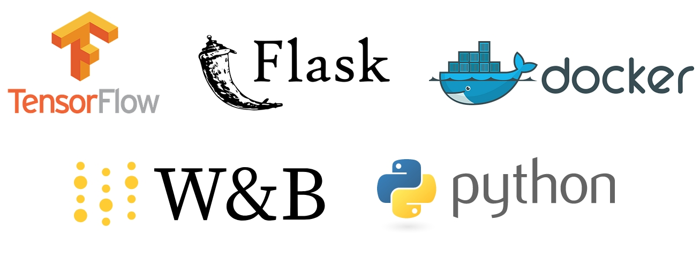

<div align="center">
  
</div>

# Tensorflow classifier service using Flask.

<a href="https://www.buymeacoffee.com/hdnh2006" target="_blank"></a>


A service for classifying birds using Tensorflow and Flask API.

## Overview

This repository contains code to register model, classify script and deploy service for a classifier model using TensorFlow. The Flask API allows for easy interfacing with the trained model.

## Directory Structure 📂

- `data`: Directory for datasets.
- `original_code`: Contains the initial version or reference code.
- `deployment`: Scripts or files related to deployment.
- `utils`: Utility scripts or functions.
- `documentation`: Project documentation.
- `report`: Project reports or analysis.
- `classify.py`: Script for running classification inference on images.
- `register_model.py`: Script for registering the trained model.

## Setup 👨‍💻

### Requirements

- Experiment tracking: wandb. FULLY REQUIRED A W&B ACCOUNT!
- Data libraries: pandas (2.0.3), numpy (1.23.2).
- ML libraries: tensorflow (2.10.0), opencv-python (>= 4.5).
- Deployment: waitress (2.1.2), Flask (2.3.2).

To install these requirements, run:

```
pip install -r requirements.txt
```

### Docker 🐋

A Dockerfile is provided to containerize the application. Build and run the Docker container using:

```
docker build -t tensorflow-classifier .
docker run --gpus all -it -e WANDB_API_KEY=your_api_key tensorflow-classifier
```

You can also use the docker container from docker hub:

```
docker run --gpus all -it -e WANDB_API_KEY=your_api_key hdnh2006/tensorflow-classifier
```

## Usage 🔥

### Classification

To run classification inference on images:

```
python classify.py
```

### Model Registration

To register the trained model:

```
python register_model.py
```


## Interactive implementation implementation 🌶️

You can deploy the API able to label an interactive way.

Run:

```bash
$ python deployment/classify_api.py --device cpu # by default is cpu, you can choose 0,1,2 if you want to choose gpu depending on the number of gpus
```
Open the application in any browser 0.0.0.0:5000 and upload your image or video as is shown in video above.


## How to use the API

### Interactive way
Just open your favorite browser and go to http://0.0.0.0:5000 and intuitevely load the image you want to label and press the buttom "Upload image".

The API will return the image labeled.

### Local testing inside specific folder
Just open your favorite browser and go to http://0.0.0.0:5000/classify?source=data/images will inference all the images inside the folder `data/images`.

The API will return the images labeled.

### Call from terminal or python program
The `client.py` code provides several example about how the API can be called. A very common way to do it is to call a public image from url and to get the coordinates of the bounding boxes:

```python
import requests

api_url = 'http://172.17.0.2:5000/classify'
resp = requests.get(f'{api_url}?source=https://www.lyricbirdfood.com/media/1880/summer-tananger.jpg&save_labels=T', verify=False)

```
And you will get a json with the following data:

```
b'{"results": [{"conf": 0.96, "class": "Microcarbo melanoleucos"}, {"conf": 0.0, "class": "Piranga rubra"}, {"conf": 0.0, "class": "Piranga olivacea"}]}'
```

## TODO

- [ ] **Calibration or Half Precision**: Implement half-precision to significantly reduce the time required for inference. Alternatively, consider using INT8 quantization for even faster inference.
  
- [ ] **Export to OpenVino for CPU Deployment**: Add functionality to export the model to OpenVino format, optimizing it for deployments on CPU.
  
- [ ] **Export to TensorRT for GPU Deployment**: Add functionality to export the model to TensorRT format, optimizing it for deployments on GPU.

- [ ] **Add Grad-CAM for Model Explainability**: Integrate Grad-CAM (Gradient-weighted Class Activation Mapping) to provide insights into which regions of the image the model focuses on during the classification process.


## About me and contact

If you want to know more about me, please visit my blog: [henrynavarro.org](https://henrynavarro.org).
